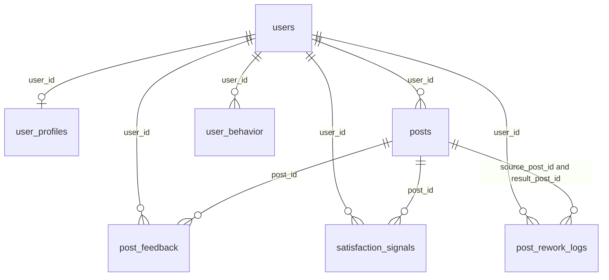

# Database overview

**Engine:** PostgreSQL (`pgcrypto` extension). **Migrations:** SQL files in [`migrations/`](migrations/), tracked in table **`schema_migrations`** (`version` = filename, `applied_at`). Sequelize models mirror these tables in [`src/models/index.js`](src/models/index.js).

---

## PostgreSQL types (enums)

| Enum | Values |
|------|--------|
| **`post_status`** | `draft`, `published`, `rejected`, `selected` (`selected` added in migration 003) |
| **`feedback_action`** | `accepted`, `rejected`, `edited`, `regenerated` |

---

## Tables (full structure)

### `users`

| Column | Type | Constraints | What we store |
|--------|------|---------------|---------------|
| `id` | `uuid` | PK, default `gen_random_uuid()` | Account id |
| `email` | `text` | NOT NULL, UNIQUE | Login email |
| `password_hash` | `text` | NOT NULL | Bcrypt (or compatible) hash |
| `created_at` | `timestamptz` | NOT NULL, default `now()` | Row created |
| `updated_at` | `timestamptz` | NOT NULL, default `now()` | Last update (trigger) |

**Relations:** parent of `user_profiles`, `posts`, `post_feedback`, `user_behavior`, `satisfaction_signals`, `post_rework_logs`. **ON DELETE CASCADE** from `users` removes all child rows.

---

### `user_profiles`

| Column | Type | Constraints | What we store |
|--------|------|---------------|---------------|
| `id` | `uuid` | PK | Row id |
| `user_id` | `uuid` | NOT NULL, UNIQUE, **FK → `users(id)` CASCADE** | Owner (one profile per user) |
| `profession` | `text` | NOT NULL, default `''` | Onboarding |
| `audience` | `text` | NOT NULL, default `''` | Onboarding |
| `vibe` | `text` | NOT NULL, default `''` | Onboarding |
| `dynamic_adjustments` | `jsonb` | NULL | Optional structured hints |
| `created_at`, `updated_at` | `timestamptz` | NOT NULL | Timestamps |

---

### `posts`

| Column | Type | Constraints | What we store |
|--------|------|---------------|---------------|
| `id` | `uuid` | PK | Post id |
| `user_id` | `uuid` | NOT NULL, **FK → `users(id)` CASCADE** | Author |
| `topic` | `text` | NOT NULL | User’s topic string for generate (not rework instructions) |
| `tone` | `text` | NULL | Optional tone hint |
| `generated_text` | `text` | NOT NULL | **JSON string**: mock AI payload, e.g. `{ "version": 1, "variations": [ { "variation_id", "text", "tone_applied", "estimated_length", "hashtags" } ] }` |
| `image_prompt` | `text` | NULL | Reserved for image pipeline |
| `image_url` | `text` | NULL | Reserved |
| `status` | **`post_status`** | NOT NULL, default `draft` | Lifecycle |
| `published_at` | `timestamptz` | NULL | If/when published |
| `selected_variation_id` | `integer` | NULL | `1` or `2` after user picks a variant |
| `selected_text` | `text` | NULL | Exact tweet body chosen (what can be posted) |
| `created_at`, `updated_at` | `timestamptz` | NOT NULL | Timestamps |

**Relations:** `post_feedback`, `satisfaction_signals` CASCADE on delete. **`post_rework_logs`** references this table twice: **`source_post_id`** (nullable, **SET NULL** on post delete) and **`result_post_id`** (required, **CASCADE** on post delete).

---

### `post_feedback`

| Column | Type | Constraints | What we store |
|--------|------|---------------|---------------|
| `id` | `uuid` | PK | Row id |
| `post_id` | `uuid` | NOT NULL, **FK → `posts(id)` CASCADE** | Post |
| `user_id` | `uuid` | NOT NULL, **FK → `users(id)` CASCADE** | Who acted |
| `action` | **`feedback_action`** | NOT NULL | Feedback type |
| `edited_text` | `text` | NULL | If user edited copy |
| `metadata` | `jsonb` | NOT NULL, default `{}` | Extra context (e.g. `variation_id`) |
| `created_at` | `timestamptz` | NOT NULL | Event time |

---

### `user_behavior`

| Column | Type | Constraints | What we store |
|--------|------|---------------|---------------|
| `id` | `uuid` | PK | Row id |
| `user_id` | `uuid` | NOT NULL, **FK → `users(id)` CASCADE** | Actor |
| `event_type` | `text` | NOT NULL | e.g. `generate_insight`, `variation_selected` |
| `payload` | `jsonb` | NOT NULL, default `{}` | Event-specific JSON (insights, topic, tone, flags, etc.) |
| `created_at` | `timestamptz` | NOT NULL | Event time |

---

### `satisfaction_signals`

| Column | Type | Constraints | What we store |
|--------|------|---------------|---------------|
| `id` | `uuid` | PK | Row id |
| `post_id` | `uuid` | NOT NULL, **FK → `posts(id)` CASCADE** | Related post |
| `user_id` | `uuid` | NOT NULL, **FK → `users(id)` CASCADE** | Submitter |
| `signal` | `text` | NOT NULL, CHECK `yes` \| `almost` \| `not_really` | One-tap satisfaction |
| `variation_id` | `integer` | NULL | Optional link to option |
| `selected_text` | `text` | NULL | Optional snapshot |
| `context` | `jsonb` | NOT NULL, default `{}` | Extra JSON |
| `created_at` | `timestamptz` | NOT NULL | When submitted |

**Constraint:** **UNIQUE (`user_id`, `post_id`)** — at most one signal per user per post.

---

### `post_rework_logs`

| Column | Type | Constraints | What we store |
|--------|------|---------------|---------------|
| `id` | `uuid` | PK | Row id |
| `user_id` | `uuid` | NOT NULL, **FK → `users(id)` CASCADE** | Who reworked |
| `source_post_id` | `uuid` | NULL, **FK → `posts(id)` ON DELETE SET NULL** | Draft post that contained the base variant (if known) |
| `result_post_id` | `uuid` | NOT NULL, **FK → `posts(id)` ON DELETE CASCADE** | **New** post row created by that rework generate |
| `base_draft_text` | `text` | NOT NULL | The **single** option’s tweet text that was refined |
| `user_instructions` | `text` | NOT NULL | User’s edit notes (**not** posted to X) |
| `source_variation_id` | `integer` | NULL | Which option (`1` / `2`) was refined |
| `model_output` | `jsonb` | NOT NULL, default `{}` | Snapshot: new `variations`, `insights`, `topic`, `tone`, `version`, `source_variation_id` |
| `created_at` | `timestamptz` | NOT NULL | When logged |

**When it is written:** only on persisted `/ai/generate` when a **rework** (instructions + base draft + `sourceVariationId`) is applied, in the same transaction as the new `posts` row.

---

## How tables connect (summary)

```
users
 ├── user_profiles (1:1, CASCADE)
 ├── posts (1:N, CASCADE)
 ├── post_feedback (1:N, CASCADE)
 ├── user_behavior (1:N, CASCADE)
 ├── satisfaction_signals (1:N, CASCADE)
 └── post_rework_logs (1:N, CASCADE)

posts
 ├── post_feedback (1:N, CASCADE)
 ├── satisfaction_signals (1:N, CASCADE)
 ├── post_rework_logs.source_post_id (1:N, SET NULL on post delete)
 └── post_rework_logs.result_post_id (1:N, CASCADE on post delete)
```



---

## Indexes (performance)

- `posts`: `(user_id, created_at DESC)`
- `post_feedback`: `post_id`; `(user_id, created_at DESC)`
- `user_behavior`: `(user_id, created_at DESC)`; `(event_type, created_at DESC)`
- `satisfaction_signals`: `user_id`, `post_id`, `signal`
- `post_rework_logs`: `(user_id, created_at DESC)`, `result_post_id`, `source_post_id`

---

## Not a physical table

**`schema_migrations`** — created by the app migrator; rows are migration filenames that have already been applied.
