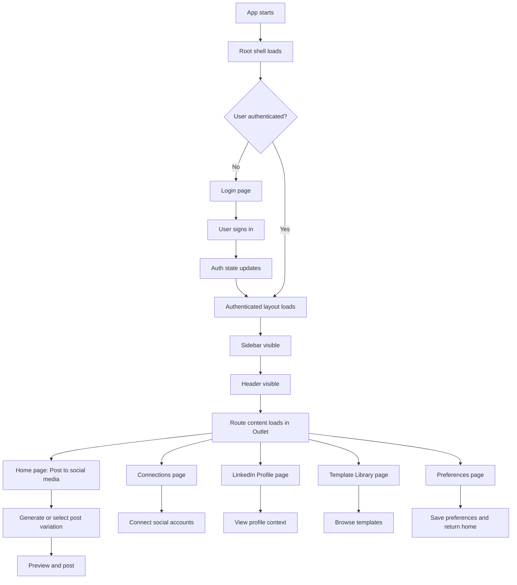

# Low-Level Design: design-guide

## 1. Scope

This document covers the low-level UI structure of the design-guide app with a focus on:
- sidebar placement and behavior
- navbar/header placement and responsibility
- page layout composition
- page flow from entry to end
- design pattern used for screen layout and navigation

The design is implemented in the React app under the design-guide folder using TanStack Router, Tailwind-based utility classes, Framer Motion, and shared UI components.

---

## 2. Main Design Goal

The app uses a shell-based layout where:
- the left rail acts as the primary navigation sidebar
- the top bar acts as the page header and action area
- the center/content area renders the currently selected route

This creates a consistent desktop-style dashboard experience with a collapsible sidebar and a top header for page title and actions.

---

## 3. Project Placement of the UI Shell

### 3.1 Root entry
The global app shell is initialized in:
- [design-guide/src/routes/__root.tsx](/design-guide/src/routes/__root.tsx)

This file provides:
- the root router setup
- theme provider
- auth provider
- loading provider
- the base document shell

### 3.2 Authenticated layout
The shared application layout is defined in:
- [design-guide/src/routes/_authenticated.tsx](/design-guide/src/routes/_authenticated.tsx)

This file is the core layout container for all logged-in pages.

### 3.3 Shared UI components
The layout pieces are implemented in:
- [design-guide/src/components/AppNavRail.tsx](/design-guide/src/components/AppNavRail.tsx)
- [design-guide/src/components/PageHeader.tsx](/design-guide/src/components/PageHeader.tsx)

These components are reused across all authenticated pages.

---

## 4. Layout Structure

### 4.1 Full-screen composition
The authenticated screen uses a two-column shell:

```text
+--------------------------------------------------------------+
|                     Application Shell                        |
| +----------------+-----------------------------------------+ |
| | Sidebar        | Main Content                           | |
| | (AppNavRail)   | +-------------------------------+   | |
| |                | | Header (PageHeaderShell)      |   | |
| |                | +-------------------------------+   | |
| |                | | Page content (Outlet)         |   | |
| |                | | - route-specific screen       |   | |
| |                | +-------------------------------+   | |
| +----------------+-----------------------------------------+ |
+--------------------------------------------------------------+
```

### 4.2 Vertical behavior
- The sidebar is fixed on the left and spans the full viewport height.
- The main content area occupies the remaining width.
- The header is placed at the top of the main content region.
- Page content appears below the header and scrolls independently.

---

## 5. Sidebar Design

### 5.1 Responsibility
The sidebar is the main navigation rail for the authenticated experience.

It is responsible for:
- showing the brand/logo
- providing navigation to the main pages
- collapsing/expanding to save space
- showing the current user/profile footer
- allowing sign out

### 5.2 Placement in the UI
The sidebar sits as the first child in the authenticated layout:

```tsx
<div className="flex min-h-screen w-full bg-background">
  <AppNavRail />
  <main className="flex flex-1 flex-col overflow-hidden">
    ...
  </main>
</div>
```

### 5.3 Visual structure
The sidebar includes three main regions:
1. Header section
   - Social AI logo
   - collapse/expand toggle button

2. Navigation section
   - links to:
     - Post to social media
     - Connections
     - LinkedIn Profile
     - Template Library
     - Preferences

3. Footer section
   - user avatar and name/email
   - sign out button

### 5.4 Behavior
- Default width: 18rem (w-72)
- Collapsed width: 88px
- Collapse state is persisted to localStorage using the key social-ai-nav-collapsed
- Active route is highlighted visually
- On collapse, labels become hidden and icons remain visible

### 5.5 Design pattern
The sidebar uses a standard dashboard navigation rail pattern:
- left-anchored persistent navigation
- icon + label navigation
- active-state indicator
- compact collapsed mode
- tooltip support on collapsed state

---

## 6. Header Design

### 6.1 Responsibility
The header is a shared top bar used by all authenticated pages.

It is responsible for:
- showing the current page title
- rendering page-specific actions
- hosting the theme toggle

### 6.2 Placement in the UI
The header is rendered inside the main content container, directly below the top of the page content area:

```tsx
<main className="flex flex-1 flex-col overflow-hidden">
  <PageHeaderProvider>
    <PageHeaderShell />
    <AnimatePresence mode="wait">
      <motion.div ...>
        <Outlet />
      </motion.div>
    </AnimatePresence>
  </PageHeaderProvider>
</main>
```

### 6.3 Structure
The header uses:
- a left-side title area
- a right-side action area
- a theme toggle button

### 6.4 Dynamic title behavior
The header title and actions are controlled through a React context provider in:
- [design-guide/src/components/PageHeader.tsx](/design-guide/src/components/PageHeader.tsx)

This means each route can define its own title and optional actions without manually passing props through every component tree.

### 6.5 Design pattern
The header follows a shared-shell pattern:
- global header container
- page-specific content injected through context
- simple and consistent placement across all pages

---

## 7. Page Content Area

### 7.1 Placement
The page content area is rendered inside the main content column, beneath the header.

It is wrapped in a scrollable container:

```tsx
<div className="flex-1 overflow-y-auto">
  <div className="px-8 py-8 lg:px-12">
    ...page-specific content...
  </div>
</div>
```

### 7.2 Content behavior
- The main content area scrolls vertically independently.
- Page sections are centered or padded depending on the page.
- Some pages use a full-width hero section, while others use grid-based forms/cards.

### 7.3 Examples
- Home page uses a split layout with form + preview
- Connections page uses a card grid
- LinkedIn Profile page uses a profile card layout
- Preferences page uses a full-width form section with cards

---

## 8. Route Flow From Entry to End

### 8.1 Route hierarchy
The main route structure is defined by the files in [design-guide/src/routes](/design-guide/src/routes):
- /login
- /_authenticated
- /_authenticated/
- /_authenticated/connections
- /_authenticated/linkedin-profile
- /_authenticated/preferences
- /_authenticated/template-library

### 8.2 End-to-end flow



### 8.3 Actual navigation behavior
1. The app loads the root shell.
2. If the user is not authenticated, the login page is shown.
3. After authentication, the user enters the authenticated shell.
4. The sidebar stays visible as the primary navigation.
5. The header changes according to the current route.
6. The route content area swaps based on the selected page.
7. The preferences page saves data and navigates back to the home route.

---

## 9. Screen Layout Pattern

### 9.1 Pattern used
The project uses a dashboard-style shell layout pattern with three zones:
- left vertical navigation rail
- top page header
- main content body

### 9.2 Why this pattern fits
This pattern is suitable because:
- the app is multi-page and navigation-heavy
- user actions need a persistent navigation surface
- page-level headers provide context and actions
- content panels can be arranged independently per route

### 9.3 Spatial placement
- Sidebar: fixed at left, full height
- Header: full-width across the main content area
- Content: below header, scrollable, padded

---

## 10. Component-Level Placement Summary

| Area | Component | Placement |
|---|---|---|
| App shell | Root route | Wraps all app providers and router shell |
| Authenticated layout | _authenticated route | Houses sidebar, header, and outlet |
| Sidebar | AppNavRail | Left side, full height |
| Header | PageHeaderShell | Top of main content area |
| Page title/actions | PageHeader context | Injected into header shell |
| Route content | Outlet | Main content body below the header |

---

## 11. Implementation Notes

### 11.1 Styling approach
The UI uses Tailwind utility classes together with CSS variables and custom theme tokens.

### 11.2 Animation approach
Framer Motion is used for page transitions and entry animations.

### 11.3 State ownership
- auth state comes from auth context
- loading state comes from loading provider
- page title/actions come from PageHeader context
- route page content keeps local UI state in each page component

---

## 12. Practical Layout Reference

### Desktop layout
```text
[Sidebar: 72px/288px wide] [Header: 56px height] [Page content]
```

### Mobile behavior
The layout remains responsive, but the sidebar is not the primary focus; content flows vertically and uses padded cards/forms.

---

## 13. Conclusion

The design-guide app uses a classic dashboard layout where:
- the sidebar provides persistent navigation
- the header provides context and page actions
- the main content area renders the selected route page
- routing and layout composition are handled through TanStack Router and shared shell components

This structure makes the UI easy to extend when adding more pages, because the shell stays stable while individual pages change inside the content area.
