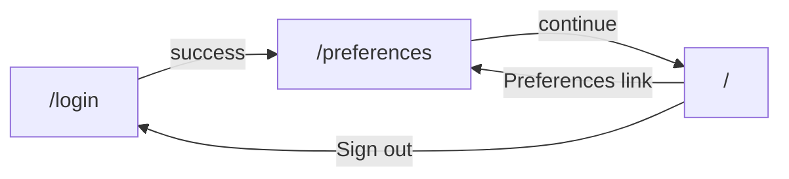

# Frontend

React + TypeScript SPA for the Social AI agent: sign in, capture preferences, generate tweet copy and an image, then post text to X.

## Pages (3)

| Route | Component | Role |
|--------|-----------|------|
| `/login` | `LoginPage` | Email/password sign-in via `loginRequest` (`/auth/login`); stores `userId` in `localStorage`. Redirects to `/preferences` when already signed in or after a successful login. |
| `/preferences` | `PreferencesPage` | Questionnaire driven by `PREFERENCE_QUESTIONS`; submits answers with `logPreferences` (`/preferences/log`), then navigates to `/`. Copy notes answers are logged on the server for now (not persisted in the database). |
| `/` | `GeneratorPage` | Main workflow: topic and optional tone → `POST /ai/generate` → preview tweet + image metadata → `POST /post/tweet` with the draft text; links to preferences and sign-out. |

Any unknown path redirects to `/` (`Navigate` in `App.tsx`).

`components/ProtectedRoute.tsx` is an `<Outlet />` guard that sends unauthenticated users to `/login`. It is **not** wired into `App.tsx` yet; you can nest `/preferences` and `/` under it when you want strict route-level protection.

## Application flow



1. **Login** — `AuthProvider` (`main.tsx`) exposes `login` / `logout` / `userId`. `login` calls `api/auth.ts` → `POST /auth/login`, then persists `userId` in `localStorage`.
2. **Preferences** — Form state is keyed by question ids from `config/preferenceQuestions.ts`. Submit calls `api/preferences.ts` → `POST /preferences/log` with `{ answers }`. `postJson` adds `X-User-Id` when `userId` is stored (`api/client.ts`).
3. **Generator** — Local state tracks topic, tone, draft text, image URL / prompt, structured `image` result (`types/generate.ts`), UI phase (`idle` | `generating` | `posting` | `done`), and error/success URL. Generate and post both use `postJson` from `api/client.ts`.

## Stack and tooling

| Area | Choice |
|------|--------|
| UI library | React 19 |
| Language | TypeScript (ES2023, `react-jsx`, bundler resolution) |
| Build / dev | Vite 8 with `@vitejs/plugin-react` |
| Routing | `react-router-dom` 7 (`BrowserRouter`, `Routes`, `Route`, `Navigate`, `Link`, `useNavigate`) |
| Lint | ESLint 9 flat config: `@eslint/js`, `typescript-eslint`, `eslint-plugin-react-hooks`, `eslint-plugin-react-refresh` |

**Environment**

- `VITE_API_BASE_URL` — API origin (defaults to `http://localhost:3001` in `src/api/client.ts`).

Scripts: `npm run dev`, `npm run build`, `npm run preview`, `npm run lint`.

## UI and styling

We do **not** use Tailwind, styled-components, or a component library. Styling is **plain CSS** with a small, consistent class vocabulary.

### Files

| File | Purpose |
|------|---------|
| `src/index.css` | Global design tokens, typography, `body` / `#root`, heading rules, light/dark themes. |
| `src/App.css` | Layout and UI “primitives”: page shell, grid, cards, form controls, buttons, banners, navigation row. |

Pages import `App.css` where they need those classes; `index.css` is loaded once from `main.tsx`.

### Design tokens (`index.css`)

- **CSS custom properties** on `:root`: `--text`, `--text-h`, `--bg`, `--border`, `--accent`, `--accent-bg`, `--shadow`, font stacks (`--sans`, `--heading`, `--mono`), etc.
- **Dark mode**: `prefers-color-scheme: dark` overrides the same variables (no manual theme toggle).
- **Responsive type**: base font size steps down under `1024px`; `h1` / `h2` scale similarly.
- **Modern CSS**: nested `@media` rules, `color-mix(in oklab, …)` for subtle surfaces and banner borders, `min-height: 100svh` on `#root`.

### Class naming and layout (`App.css`)

- **Semantic layout**: `.page`, `.header`, `.grid` (1 column → 2 columns from `900px`), `.row`, `.row.spread`.
- **Components**: `.card`, `.input`, `.label`, `.btn` with modifiers `.primary` and `.ghost`, `.banner` with `.error` / `.ok`, `.preview`, `.count.bad`, etc.
- **Pattern**: single responsibility class names (not strict BEM, but similar idea: blocks + modifiers as extra classes).

### Accessibility and polish

- Form labels tied to inputs with `htmlFor` / `id`.
- Error regions use `role="alert"` where applicable.
- Focus on readable contrast using token-driven colors in both schemes.

## Project structure and patterns

```
src/
  api/
    client.ts      # getJson / postJson; base URL; X-User-Id from localStorage; error mapping
    auth.ts        # loginRequest → POST /auth/login
    preferences.ts # logPreferences → POST /preferences/log
  components/
    Actions.tsx        # Post / reset actions for the generator
    ImagePanel.tsx     # Image preview, prompt, and structured image result status
    StatusBanner.tsx   # Loading, error, and post-success states
    TopicForm.tsx      # Topic, tone, and generate trigger
    TweetPreview.tsx   # Draft preview with character guidance
    ProtectedRoute.tsx # Optional auth guard (Outlet + Navigate)
  config/
    preferenceQuestions.ts  # ids, labels, placeholders for the preferences form
  context/
    AuthContext.tsx   # userId, login, logout; wraps app in main.tsx
  pages/
    LoginPage.tsx
    PreferencesPage.tsx
    GeneratorPage.tsx
  types/
    auth.ts
    preferences.ts
    generate.ts      # GeneratePipelineResponse, ImageResult
  App.tsx            # Route definitions
  main.tsx           # Entry: router + AuthProvider + global CSS
```

- **Pages vs components**: `GeneratorPage` owns workflow state and API calls; smaller components receive props and callbacks for topic/tone, preview, image panel, status, and actions.
- **API layer**: Low-level transport in `client.ts`; feature-specific wrappers in `auth.ts` and `preferences.ts`. The generator calls `postJson` directly for `/ai/generate` and `/post/tweet`.
- **Types**: Domain contracts live under `src/types/` and match backend JSON shapes (snake_case fields such as `image_url`, `image_prompt` where applicable).
- **Config**: Copy and structure for preferences stay in `preferenceQuestions.ts` so marketing or product edits do not touch layout code.

This keeps styling predictable (global tokens + shared classes), routing explicit, and data access grouped by feature for backend integration.
